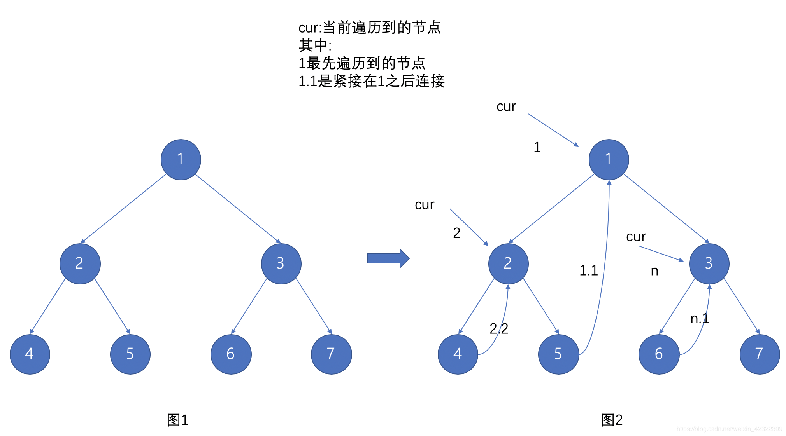

# 二叉树前序遍历

## 题目

> [中文站](https://leetcode-cn.com/problems/binary-tree-preorder-traversal/) [国际站](https://leetcode.com/problems/binary-tree-preorder-traversal/)

给你二叉树的根节点 `root` ，返回它节点值的  **前序**  遍历。

**示例 1：**


```
输入：root = [1,null,2,3]
输出：[1,2,3]
```

**示例 2：**

```
输入：root = []
输出：[]
```

**示例 3：**

```
输入：root = [1]
输出：[1]
```

**示例 4：**


```
输入：root = [1,2]
输出：[1,2]
```

**示例 5：**


```
输入：root = [1,null,2]
输出：[1,2]
```

**提示：**

- 树中节点数目在范围 [0, 100] 内
- -100 <= Node.val <= 100

**进阶：** 递归算法很简单，你可以通过迭代算法完成吗？

## 解法

### 递归 O(n)

前序遍历的访问顺序为：父节点-左子树-右子树；而对左右子树的访问亦遵循上面的原则，而递归的方式天然满足这种树的遍历过程。

```typescript
function preorderTraversal(root: TreeNode | null): number[] {
  const result: number[] = [];
  if (!root) return result;

  result.push(root);
  result.push(...preorderTraversal(root.left));
  result.push(...preorderTraversal(root.right));
  return result;
}
```

### 栈迭代 O(n)

递归的方式是借助了操作系统维护的栈完成的遍历，我们也可以手动维护一个栈来完成树的遍历，两者是等价的。

```typescript
function preorderTraversal(root: TreeNode | null): number[] {
  const result: number[] = [];
  const stack: (TreeNode | null)[] = [root];
  while (stack.length) {
    const node = stack.pop();
    if (node == null) continue;
    result.push(node.val);
    stack.push(node.right, node.left);
  }
  return result;
}
```

### 栈迭代 O(n)

另一种栈维护方式

```typescript
function preorderTraversal(root: TreeNode | null): number[] {
  const result: number[] = [];
  const stack: TreeNode[] = [];
  while (root) {
    result.push(root.val);
    if (root.right) stack.push(root.right);
    root = root.left;
    if (!root && stack.length) {
      root = stack.pop();
    }
  }
  return result;
}
```

### 栈迭代 + 类型区分 O(n)

访问过的节点会将其值存入栈中，未访问过的节点则将节点本身存入栈中；从栈内取出节点时，判断其类型，若为值则插入结果集，若为节点，则继续走遍历逻辑；通过这种方式，可以达到前中后序遍历的代码逻辑基本一致。

```typescript
function preorderTraversal(root: TreeNode | null): number[] {
  const result: number[] = [];
  const stack: (TreeNode | number | null)[] = [root];
  while (stack.length) {
    const node = stack.pop();
    if (node == null) continue;
    if (typeof node === "number") {
      result.push(node);
    } else {
      stack.push(node.right, node.left, node.val);
    }
  }
  return result;
}
```

### Morris 遍历 O(n), space O(1)

无需额外维护栈空间，只占用常量空间。其核心思想是利用大量空闲指针，实现空间开销的极限缩减。整体思路是以某个根节点开始，找到其左子树的最右侧节点，将最右侧节点的右指针与根节点连接，以达到指针可以完整的遍历完整棵树的目的。



**通用逻辑：**

1. 维护当前节点及其左子树的最有子节点的指针。
2. 若当前节点左子节点为空，则表示无需往左侧遍历了，将当前节点切到其右子节点进行遍历。
   1. 若当前节点的左子节点不为空，则找到其左子树的最右侧节点：
   2. 若最右侧节点的右子节点为空，则将其右子节点与当前节点连接，再将当前节点切换到左子节点进行遍历。
3. 若最右侧节点的右子节点为当前节点，说明左子树已经处理完成，把连接断开，并将当前节点切到其右子节点进行遍历。
4. 重复 2、3 步骤直至遍历结束。

```typescript
function preorderTraversal(root: TreeNode | null): number[] {
  const result: number[] = [];
  if (!root) return result;

  let p1 = root;
  let p2: TreeNode | null;
  while (p1) {
    p2 = p1.left;
    if (!p2) {
      result.push(p1.val);
      p1 = p1.right;
      continue;
    }
    while (p2.right && p2.right !== p1) {
      p2 = p2.right;
    }
    if (p2.right) {
      p2.right = null;
      p1 = p1.right;
    } else {
      p2.right = p1;
      result.push(p1.val);
      p1 = p1.left;
    }
  }
  return result;
}
```
